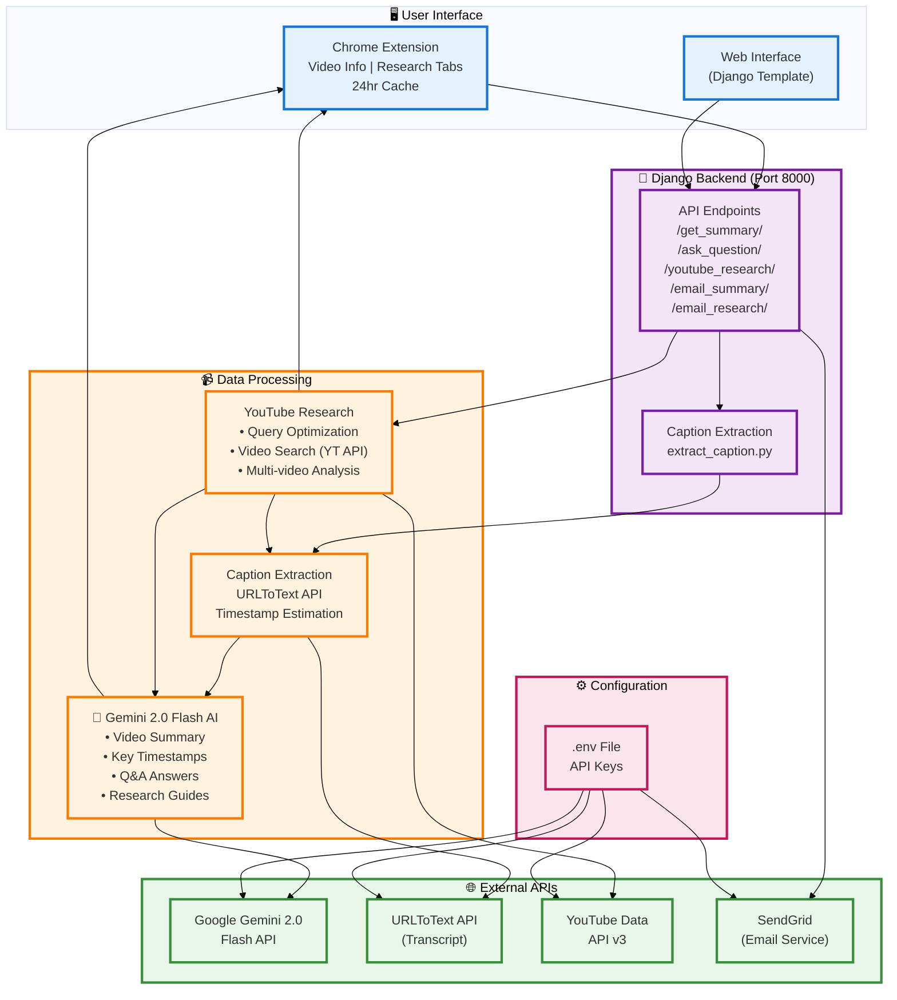

# YouTube Copilot - System Architecture

## Key Components

### Frontend (Chrome Extension)
- **Popup UI**: React-like tabbed interface with main tabs (Video Information, YouTube Research)
- **Sub-tabs**: Summary, Timestamps, Q&A under Video Information
- **Caching**: 24-hour local cache using Chrome Storage API

### Backend (Django)
- **Caption Extraction**: URLToText API integration for video transcripts
- **AI Processing**: Google Gemini 2.0 Flash for all AI operations
- **Email Service**: SendGrid for sending summaries and research guides

### Data Flow
1. **Video Analysis**: URL → Caption Extraction → AI Processing → Cache → Display
2. **Q&A**: Question + Captions → Gemini → Answer → Cache
3. **Research**: Topic → Query Optimization → YouTube Search → Multi-video Analysis → Learning Guide
4. **Email**: Content → Template Rendering → SendGrid → User Email

### External Dependencies
- **Google Gemini 2.0 Flash**: Summary, timestamps, Q&A, research guide generation
- **URLToText API**: YouTube video transcript extraction
- **YouTube Data API v3**: Video search for research feature
- **SendGrid**: Email delivery service

### Configuration
All API keys stored in `.env` file and loaded via `python-dotenv`

